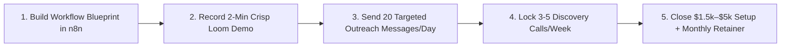

# 🚀 NEWERA AUTOMATIONS — 5 PROPRIETARY HIGH-TICKET DEMO WORKFLOWS MASTER PLAN

> **Document Version**: 2.0 (Ground-Reality Verified & Production Architecture Ready)  
> **Target Deal Value**: $1,000 – $5,000+ / ₹50,000 – ₹2,500,000+ per client build  
> **Core Automation Engine**: n8n (Self-Hosted / Low-Code Orchestrator) + OpenAI / Claude API + WhatsApp Business API

---

## 📌 EXECUTIVE SUMMARY & MARKET POSITIONING

Generic automations (like simple contact forms or basic chatbot auto-replies) are commoditized and hard to sell. **NewEra Automations** builds **Mission-Critical Operational Engines** that solve high-friction, margin-killing problems for business owners.

Each workflow below is designed to be built in n8n, demonstrated via a 2-3 minute Loom video, and pitched to target decision-makers across LinkedIn, WhatsApp, and Email.

---

## 🏢 WORKFLOW 1: REAL ESTATE & PROPERTY DEVELOPERS

### 🌟 System Name: "Omni-Channel Lead Ingestion, Speed-to-Lead AI Agent & CP Attribution Engine"

#### ❌ The Verified Real-World Problem
* **Lead Leakage Chaos:** Leads arriving from 99acres, MagicBricks, Housing.com, Meta Ads, and Channel Partners (CPs) sit unassigned for 3 to 12 hours.
* **Cherry-Picking & Dropoff:** Sales reps cherry-pick high-budget leads while 60% of inquiries go cold. In competitive real estate markets, a 15-minute delay drops conversion by 80%.
* **Channel Partner Disputes:** Missing CP attribution codes leads to massive commission disputes and broken broker relationships.

#### 🛠️ n8n Technical Architecture & Node Flow
1. **Trigger Node:** Multi-webhook ingestion listener receiving webhooks from 99acres, MagicBricks, Meta Ads API, and web forms.
2. **Normalization Node:** JavaScript Code Node standardizing lead fields (`name`, `phone`, `source`, `campaign_id`, `cp_code`).
3. **Speed-to-Lead AI Agent (WhatsApp Business API):** 
   - Fires an instant WhatsApp dialogue within 3 seconds.
   - *Prompt:* Qualifies budget (e.g. ₹1.5 Cr–₹3 Cr), preferred location/configuration (2BHK/3BHK), and move-in timeline (Immediate / 6 months).
4. **Inventory Match Node:** Queries PostgreSQL / Google Sheets inventory database to fetch top 3 available unit floor plans and dynamic brochures.
5. **Calendar Lock & CP Attribution Node:** 
   - Generates Cal.com site-visit booking link mapped to available sales rep.
   - Auto-creates lead in SalesTown / LeadSquared CRM with locked CP attribution code.
   - Pushes urgent Slack / WhatsApp notification to assigned sales manager.

#### 🔌 Software Stack & APIs Connected
`n8n` | `WhatsApp Business API (Wati/Interakt)` | `99acres Webhook` | `LeadSquared / SalesTown CRM` | `Cal.com` | `PostgreSQL`

#### 📹 2-Minute Loom Pitch Script
> *"Hey [Developer Name], did you know that 60% of ad leads from 99acres and Meta Ads drop off simply because your team takes 3 hours to respond? Here is how our Speed-to-Lead AI Agent responds on WhatsApp in 3 seconds, conversationally qualifies their budget, pulls matching 3BHK inventory automatically, and locks a site visit on your rep's calendar—with 100% Channel Partner attribution tracking."*

---

## 🛒 WORKFLOW 2: E-COMMERCE & D2C BRANDS

### 🌟 System Name: "Autonomous RTO Shield, COD WhatsApp Verification & Real-Time NDR Recovery Engine"

#### ❌ The Verified Real-World Problem
* **RTO (Return to Origin) Margin Killer:** In Indian D2C, Cash on Delivery (COD) accounts for 60-70% of orders, but suffers a **25-40% RTO rate**. Shipping forward and backward + repackaging eats 30% of net profits.
* **Fake Orders & Delivery Failure Delays:** Impulsive/fake COD orders pass through unverified. When couriers face delivery failures (NDR), customer re-attempts take 48-72 hours, resulting in returned parcels.
* **Multi-Channel Inventory Lag:** Selling across Shopify, Amazon, Flipkart, and Meesho leads to stockout overselling errors.

#### 🛠️ n8n Technical Architecture & Node Flow
1. **Trigger Node:** Shopify / WooCommerce `Order Created` Webhook.
2. **Risk & Address Validation Node:**
   - Filters order by payment method (`COD` vs `Prepaid`).
   - AI Address Cleaning Node checks pincode validity and flags incomplete addresses or known high-risk delivery zones.
3. **1-Tap WhatsApp Verification AI:**
   - Sends an interactive WhatsApp message with buttons: `[Confirm Order]` / `[Cancel Order]`.
   - If unconfirmed within 2 hours, triggers automated polite IVR verification call or holds order fulfillment.
4. **Real-Time NDR Courier Webhook Recovery:**
   - Ingests Non-Delivery Report (NDR) webhooks from Shiprocket / Delhivery API immediately upon failed delivery attempt.
   - Fires instant WhatsApp message to buyer: *"We tried delivering your order! When should our courier reattempt today?"*
   - Pushes selected delivery slot directly back into Shiprocket NDR API.
5. **Inventory Sync Buffer Engine:** Updates central stock inventory database and syncs remaining stock to Shopify, Amazon, and Flipkart via API.

#### 🔌 Software Stack & APIs Connected
`Shopify API` | `Shiprocket / Delhivery Webhooks` | `WhatsApp Business API` | `OpenAI GPT-4o` | `Unicommerce / PostgreSQL`

#### 📹 2-Minute Loom Pitch Script
> *"Hey [Brand Founder], if your brand is doing 1,000+ COD orders a month, RTO is destroying your bottom line. Watch how our n8n RTO Shield validates COD addresses on WhatsApp within seconds of checkout, and automatically intercepts courier non-delivery reports to slash your RTO rate from 35% down to under 12%."*

---

## 🩺 WORKFLOW 3: HEALTHCARE & DENTAL / AESTHETIC CLINICS

### 🌟 System Name: "24/7 Patient Intake, Tiered Consultation Deposit & Multi-Touch No-Show Reduction Loop"

#### ❌ The Verified Real-World Problem
* **High Consultation No-Show Rate:** 30% to 40% of patients who book consultations for high-ticket procedures (Dental Implants, Invisalign, Hair Restoration, Botox) fail to show up, leaving expensive practitioner chairs empty.
* **Reception Paperwork Friction:** Patients spend 15 minutes filling out manual paper intake forms upon arrival, delaying appointments.
* **Lost Post-Treatment Recall Revenue:** Clinics forget to follow up with patients for 6-month hygiene recall or multi-stage treatments.

#### 🛠️ n8n Technical Architecture & Node Flow
1. **Trigger Node:** Inbound inquiry via WhatsApp, website form, or Practo booking.
2. **Conversational Triage & Deposit Engine:**
   - WhatsApp AI bot greets patient, identifies treatment interest (e.g. Invisalign vs Routine Checkup).
   - For high-ticket treatments, auto-generates dynamic Razorpay / Stripe payment link for a nominal refundable consultation deposit.
3. **Digital Intake Form Ingestion:**
   - Sends conversational intake questions (symptoms, medical history, insurance details) on WhatsApp.
   - Syncs structured data directly into Google Sheets / Clinic Management System (Cliniko/Practo).
4. **Multi-Touch Reminder & Slot Re-Allocation Loop:**
   - Cron node runs every hour checking upcoming Google Calendar appointments.
   - Triggers automated WhatsApp reminders at **48 Hours**, **24 Hours**, and **2 Hours** with a `[1-Click Reschedule]` button.
   - If canceled, immediately offers the newly freed slot to waitlisted patients.
5. **Post-Treatment Google Review Collector:** Auto-sends post-care instructions after treatment completion and requests a 5-star Google Business review.

#### 🔌 Software Stack & APIs Connected
`n8n Cron & Webhook` | `Google Calendar` | `WhatsApp API` | `Razorpay / Stripe` | `Cliniko / Practo API` | `Google Business Profile API`

#### 📹 2-Minute Loom Pitch Script
> *"Dr. [Name], an empty dental or aesthetic chair costs your clinic ₹15,000+ every single day. Here is how our automated Patient Intake system collects refundable consultation deposits, sends automated 3-step WhatsApp reminders, and auto-fills canceled slots so your clinic runs at 95%+ capacity."*

---

## 💼 WORKFLOW 4: B2B SAAS & DIGITAL AGENCIES

### 🌟 System Name: "Post-Call AI Proposal Generator & Autonomous Client Onboarding OS"

#### ❌ The Verified Real-World Problem
* **Proposal Generation Drag:** Sales reps spend 3-5 hours after discovery calls drafting custom proposals. Taking 2-4 days to deliver proposals causes lead buying intent to drop by 50%.
* **Post-Close Setup Bottleneck:** Once a client signs, manually creating Slack channels, Google Drive folders, ClickUp boards, and contracts wastes 3+ hours per account.

#### 🛠️ n8n Technical Architecture & Node Flow
1. **Trigger Node:** Webhook from sales call recording software (Fireflies.ai / Fathom / Otter.ai) when call transcript completes.
2. **AI Scope & Pricing Extractor:**
   - GPT-4o parses transcript to extract client goals, budget, scope items, deliverables, and proposed timeline.
3. **Dynamic Proposal Generation Node:**
   - Auto-fills Google Slides / PandaDoc proposal template with customized scope, pricing table, and case studies.
   - Generates shareable PDF link and drafts a personalized email in Gmail/Outlook for rep review.
4. **Autonomous Client Onboarding Loop (Triggered by Contract E-Signature Webhook):**
   - Creates private Client Slack Channel (`#client-[name]`) and invites team.
   - Provisions structured Google Drive folder hierarchy (`01_Contracts`, `02_Assets`, `03_Deliverables`).
   - Clones master ClickUp / Asana project board template with milestone deadlines.
   - Fires welcome email with Client Onboarding Questionnaire form.

#### 🔌 Software Stack & APIs Connected
`Fireflies.ai / Fathom` | `n8n AI LLM Node` | `PandaDoc / Google Slides API` | `Slack API` | `ClickUp / Asana API` | `Google Drive API`

#### 📹 2-Minute Loom Pitch Script
> *"Hey [Agency Owner], why wait 3 days to send a proposal when your competitor sends it in 10 minutes? Watch how our AI ingests your Fireflies call transcript, generates a customized 10-slide proposal in 60 seconds, and automatically builds your Slack channels and ClickUp boards the moment the contract is signed."*

---

## ⚖️ WORKFLOW 5: CA FIRMS, TAX & LEGAL CONSULTANTS

### 🌟 System Name: "Client Document Ingestion, Bank Statement OCR Parser & Tally Auto-Reconciliation Engine"

#### ❌ The Verified Real-World Problem
* **Document Collection Chaos:** Clients dump blurry WhatsApp photos, misnamed PDFs, and mixed invoices into random chats.
* **Manual Data Entry Payroll Waste:** Junior accountants spend 20-30 hours per month typing bank statement debits/credits line-by-line into Tally Prime.
* **Compliance Deadline Panic:** Chasing clients for monthly GST / TDS documents causes severe filing rush and penalty risks.

#### 🛠️ n8n Technical Architecture & Node Flow
1. **Trigger Node:** Inbound document submission via WhatsApp API or secure client web upload portal.
2. **AI Vision Document Classifier & Cleaner:**
   - GPT-4o Vision node analyzes uploaded file.
   - Identifies document type (PAN Card, Aadhaar, Bank Statement, Tax Invoice) and checks legibility.
   - Auto-names file (`[ClientName]_[DocType]_[Period].pdf`) and places it into organized Google Drive/SharePoint folder.
3. **Bank Statement OCR & Ledger Mapping Parser:**
   - AI parser extracts transaction date, narration, debit/credit amount, and balance across 300+ Indian bank statement formats.
   - Maps narration (e.g. `NEFT-SUPPLIER-XYZ`) to corresponding Tally ledger head.
4. **Tally Prime Voucher Posting Node:**
   - Formats extracted data into Tally XML / JSON format.
   - Pushes vouchers directly into Tally Prime via local n8n agent / Tally API gateway.
5. **Automated Compliance Reminder Cron:**
   - Scheduled n8n workflow checks monthly GST/TDS filing status and sends automated WhatsApp follow-ups for pending documents.

#### 🔌 Software Stack & APIs Connected
`n8n Webhook & Vision Node` | `WhatsApp Business API` | `Google Drive / SharePoint API` | `Tally Prime Gateway / XML` | `OpenAI GPT-4o Vision`

#### 📹 2-Minute Loom Pitch Script
> *"Sir, if your junior accountants are spending 20+ hours a month manually entering bank statements into Tally, you are wasting payroll on data entry instead of advisory. Here is how our n8n Vision engine automatically sorts client WhatsApp documents, parses bank statements, and posts vouchers directly into Tally Prime."*

---

## 🎯 60-DAY OUTREACH EXECUTION STRATEGY

1. **Build Blueprint First**: Build and test the n8n JSON blueprint for 1 workflow at a time.
2. **Record Real Working Demo**: Show actual trigger, AI execution, and destination app updating live in Loom.
3. **Outreach Channels**:
   - **LinkedIn DM**: Target Founders, Developers, Managing Partners.
   - **WhatsApp Outreach**: Send Loom preview link to verified business numbers.
   - **Cold Email**: Send 2-paragraph problem-focused email with Loom embedded.
